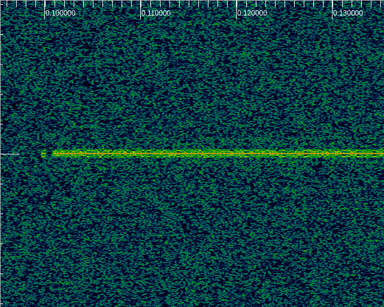
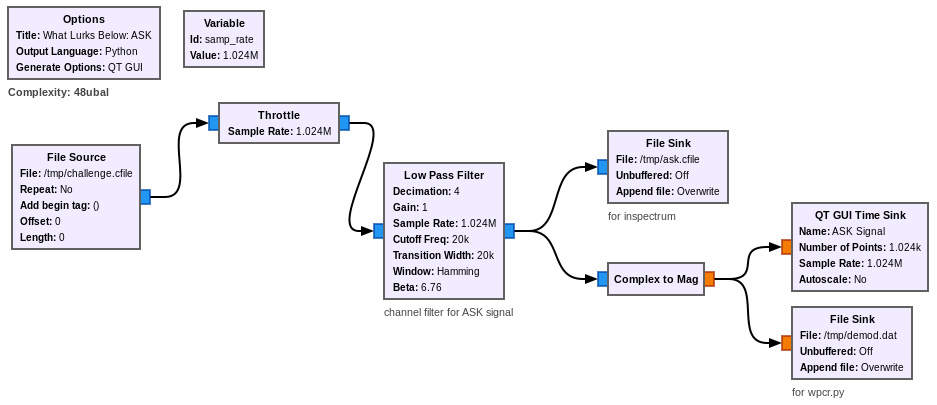
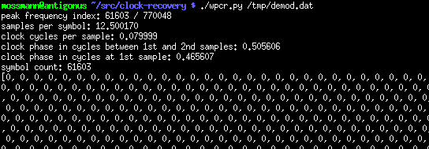
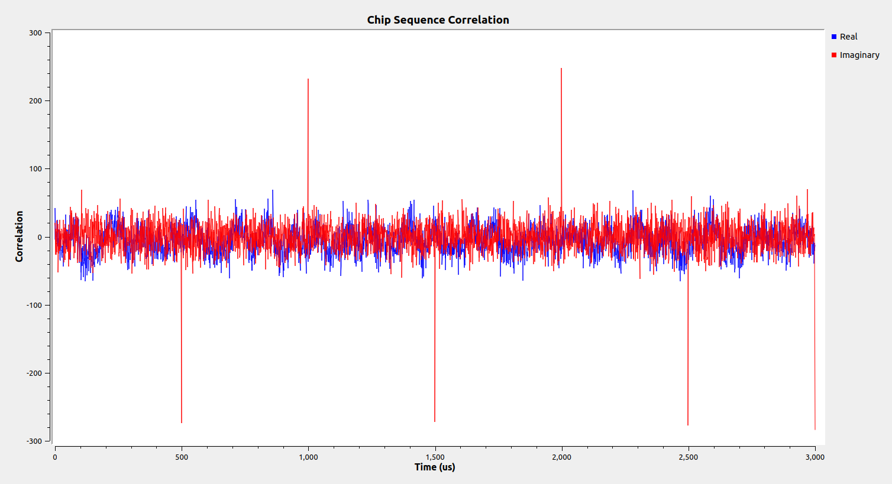
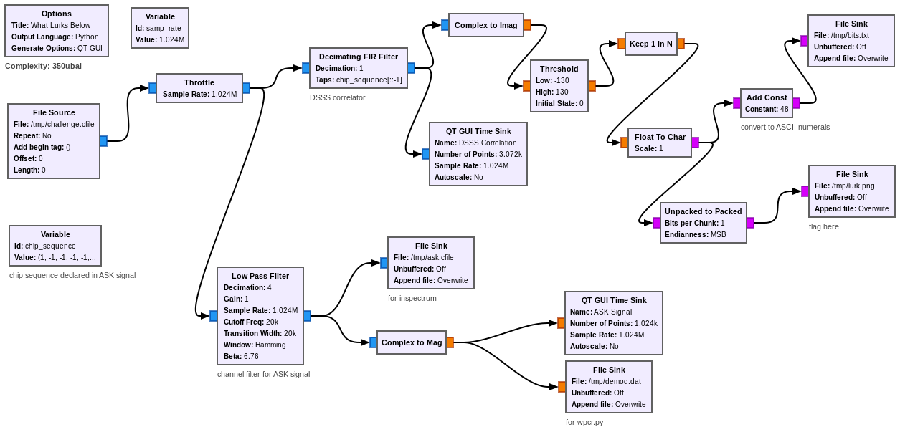

# What Lurks Below

## Challenge Description

"This one seems to be straight forward, but there is no flag to be found! Sample rate = 1024k"

[challenge.cfile](challenge.cfile)

## Decoding ASK

Just before I started looking at this challenge, [@miek](https://github.com/miek) had pointed out that that there was something that looked like an ASK signal in the file, but then he had to stop working on it.  The .cfile format, common in the [GNU Radio](https://www.gnuradio.org/) community, is a sequence of complex-valued samples, each represented by a pair of 32-bit floats.  I opened the file in [inspectrum](https://github.com/miek/inspectrum) and saw the signal he had observed.



The signal was fairly narrowband compared to the file's bandwidth, and the file included a lot of background noise that obscured the signal a bit.  To make it easier to work with, I filtered and decimated the signal with a small GNU Radio flowgraph.

[](lurk-ask.grc)

At this point it appeared to become possible to reliably decode the ASK signal using `inspectrum`'s derived amplitude and threshold plots.  I began to decode the data that way but quickly realized that the number of bits in the file was quite large.  I also noticed that the data appeared to be Manchester encoded.  In Manchester encoding there are two symbols (low-high or high-low) used to encode each data bit, so there is never a string of more than two like symbols (low-low or high-high) in a row.


To save time, I added a demodulated output to my flowgraph (above) and used my [wpcr.py](https://github.com/mossmann/clock-recovery) to extract the transmitted bits.  I first demonstrated `wpcr.py` in [Whole Packet Clock Recovery](https://archive.org/details/WholePacketClockRecoveryGrcon16) at the 2016 GNU Radio Conference.



Although there was a large number of bits, I soon observed in a text editor that there were several repetitions of a shorter sequence.  I pasted the shorter sequence into Python to decode it.

```python
#!/usr/bin/env python3

from bitstring import Bits

symbols = Bits('0b1001101001101001101001101001010110010101100101101001011010011001101001101010101010010101101001011001010110011010100101101010100110010101101001101001010110011010100101101001100110010110100110101010011010101010100101011001101010010110011010101001011010011001101001101010101010010101100110101001010110100110100101101010100110010110010101101001010110100101100101101001011010010110100110011001010110100110101001101010101010100110011010101001010110100101100101101010100110010110010110011001010110101010100101100101101010010110100110011010011010101010100101011010011010010110101010011001010110011010100101101001100110100110101010101010010101011001101001101010101010100101101010011010010110101010101001011010011010100101100110101001011001100101101001100110100110100110010101101010011010101010100110011001101010010110011010101001011010011001101001101010101010010110101001011001011001101010100101100110100110010101101010101010011010101010100101011010010110010110100110011001010110101001100101011001100110010110100110011001011001010110100101101010010110010110100110011010011010101010100101100110100110010101101001011010010101100110101001101010101010101010011001100110101010101010101010100101101001100101100110101001101010101001010110011001101001101001101001011001010110101010011001010110101010100101011010101001011001011010011001010110011010101010010101101010010110010110010110101010101001101001100110100110100101100110010110100101011001010101100110101010011010100110010110011010010110101010010110101010100110011001010101011010100101101010011010011001010110010110011010101010100110100101100101010101101001010110010110010101011001010110101010010101100101011001011001100110010110011010101001101001011010010101010110100101011010101001101010101010101010011001100110100101100101101010100101010110101001010101100101010110101001101010010110101001101010101001100110010110101010010110101010010101011001101001011010011010011001010101100110011001011001100110101010010110010110010110100101101010010110100110100110100101100101010110011001100101011001100101100101010101010101010110011001101001100110010110010101011001011001011010010101011010100101101001011001011001011010101001100101101010011001100101101010100110011010101010')

manchester = {
        '01': 1,
        '10': 0,
}

decoded = [manchester[pair.bin] for pair in symbols.cut(2)]
data = Bits(decoded)
print(data.tobytes())
```

The output included a string of ASCII text.

```
b'I\'ve started the transfer (sample rate = 1024k). The chip sequence is: \n\x80\x0c\xb4A\xd4\x93p\xb88l\xba\x0e6\xc0\x94\x9a\xce\xf4"\xd3\x0c\x15\xf1\x89v\x817\xce\xde\xe1\xdd\xabBg\xce\x10\x05M\x87\x8fx\x8cAXa\xe9\x92\xf5j\x1bf2M\xea\xeb\x7f\xeaV\xf6\xcf\x19\xb6\x16+\n\x00
```

I stripped off the newlines and null termination from the binary portion of the ASK message to recover the 512-bit chip sequence.

```
0x800cb441d49370b8386cba0e36c0949acef422d30c15f189768137cedee1ddab4267ce10054d878f788c415861e992f56a1b66324deaeb7fea56f6cf19b6162b
```

## Decoding DSSS

The mention of a chip sequence in the ASK data strongly suggested the presence of a Direct-Sequence Spread Spectrum (DSSS) signal buried in the noise (also hinted at by the challenge title).  I've spoken about [Reverse Engineering DSSS](https://archive.org/details/ReverseEngineeringDsss2017ReconMontreal), so I know a few tricks and have some tools available, but I quickly discovered that some of my usual tricks did not work on this challenge for some reason.

I was also confused at first about the chip rate of the transmission.  The challenge description said that the file was sampled at a rate of "1024k" and the ASK message suggested that the DSSS signal was transmitted with "sample rate = 1024k".  I didn't realize immediately that this was referring to the chip rate, meaning that the chip rate was equal to the sample rate of the file.  When capturing DSSS signals over the air, I typically capture with a sample rate of at least twice the chip rate, and my tools assume oversampling by that amount (and typically not with an integer number of samples per chip).

Once I realized that "sample rate" might mean "chip rate" in the ASK message, I tried correlating the samples in the file with the chip sequence in GNU Radio.  The results clearly confirmed the presence of a DSSS signal with one sample per chip.



I used Python to decode the DSSS signal.

```python
#!/usr/bin/env python3

import numpy
import scipy.signal
from bitstring import Bits

chip_sequence = 0x800cb441d49370b8386cba0e36c0949acef422d30c15f189768137cedee1ddab4267ce10054d878f788c415861e992f56a1b66324deaeb7fea56f6cf19b6162b

samples = numpy.fromfile('challenge.cfile', dtype=numpy.complex64)
chips = (numpy.array(Bits(bin(chip_sequence))) * 2) - 1
correlation = scipy.signal.correlate(samples, chips)

# The input signal is a single synthesized file, so we can depend on a fixed
# chip rate and phase.  Take the imaginary part of the correlation every 512
# samples (the chip sequence length).
data = Bits((correlation[511::512].imag > 0) * 1)

print(data)
output = open('lurk.png', 'wb')
output.write(data.tobytes())
output.close()
print('wrote output to lurk.png')
```

Initially I printed the decoded bytes to the terminal, but after noticing that the binary data started with a PNG header I added .png file output to the program.  The flag was found by viewing the PNG!


## All Together Now

I realized once this was done that my experimental GNU Radio flowgraph was very nearly a complete solution, so I went back and added PNG output to it.  This flowgraph also includes the ASK decoding.  The only thing it lacks is extraction of the chip sequence from the ASK message.

[](lurk.grc)

## Notes on Synthesis

While poking around at the ASK signal I noticed a couple of quirks.  The signal was only present in the real axis of each complex sample, not the imaginary axis.  Additionally it had a very consistent symbol rate of exactly 50 samples per symbol (12.5 after I had decimated by four).  It is possible that something fancier than ASK was intended, but I think the most likely explanation for these quirks is that the signal was synthesized in the simplest possible way by adding ones and zeros to the samples in the file, fifty at a time.  Similarly the DSSS signal was synthesized with exactly one sample per symbol.  Both signals were centered at exactly 0 Hz in complex baseband.  These characteristics would be essentially impossible in any waveform received over-the-air (or processed through a channel model to simulate over-the-air transmission).
